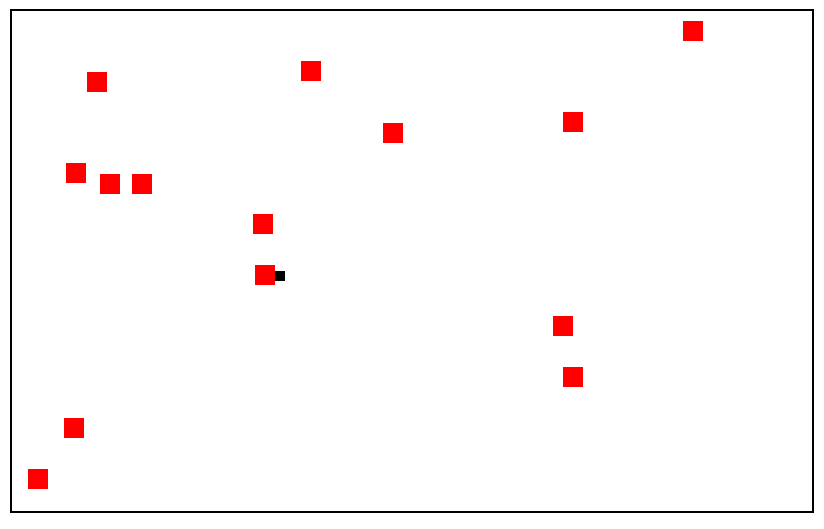

# Keyboard Hero

A web game with a unique control scheme: instead of moving your character with WASD or the arrow keys, you act like the keyboard is a separate touch screen. So to move to the top left, you hit `q`. To move to the bottom right, you hit `m`. And so on.

